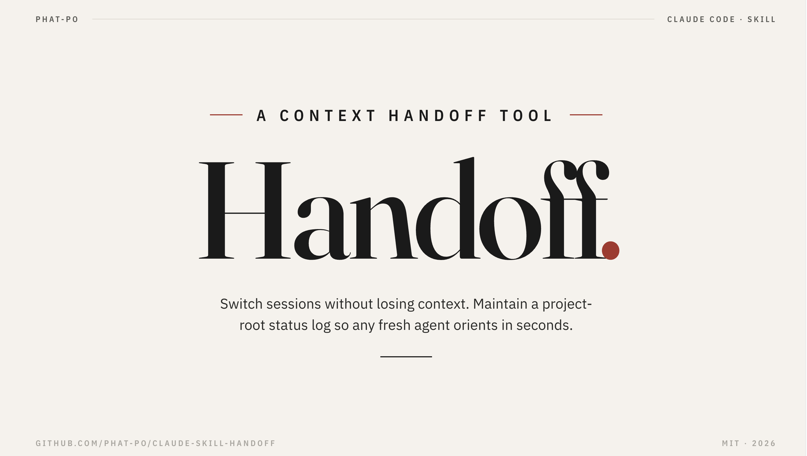
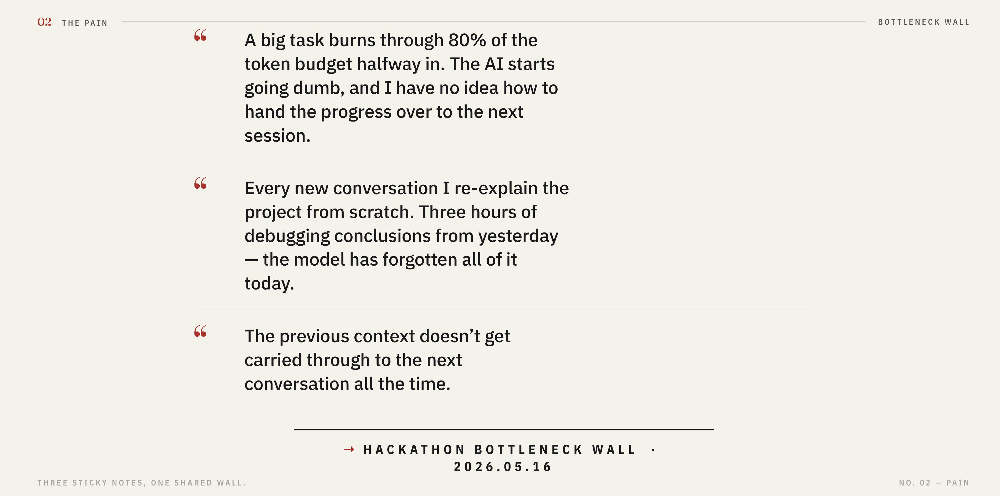
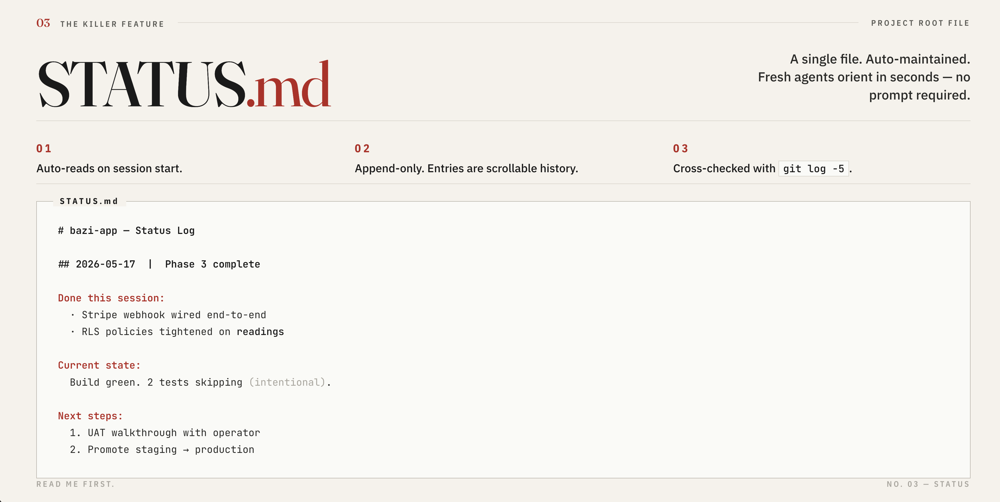
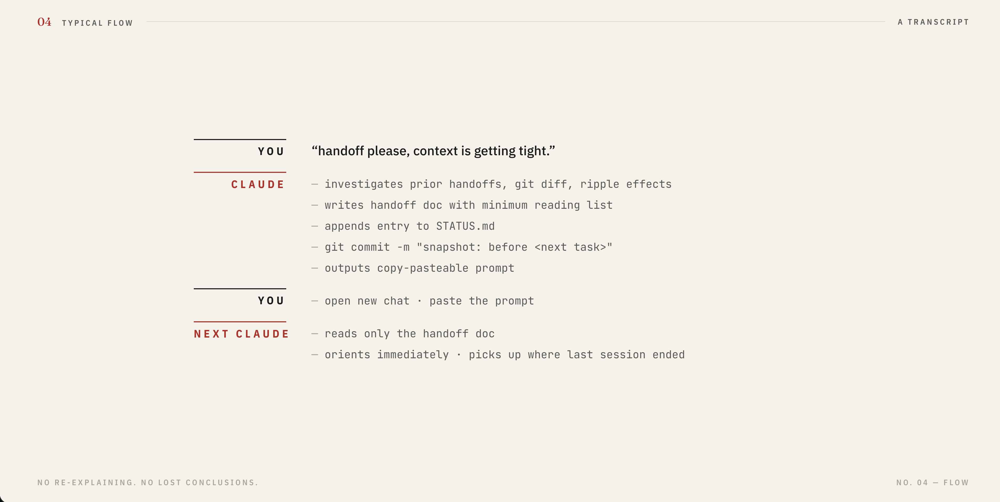
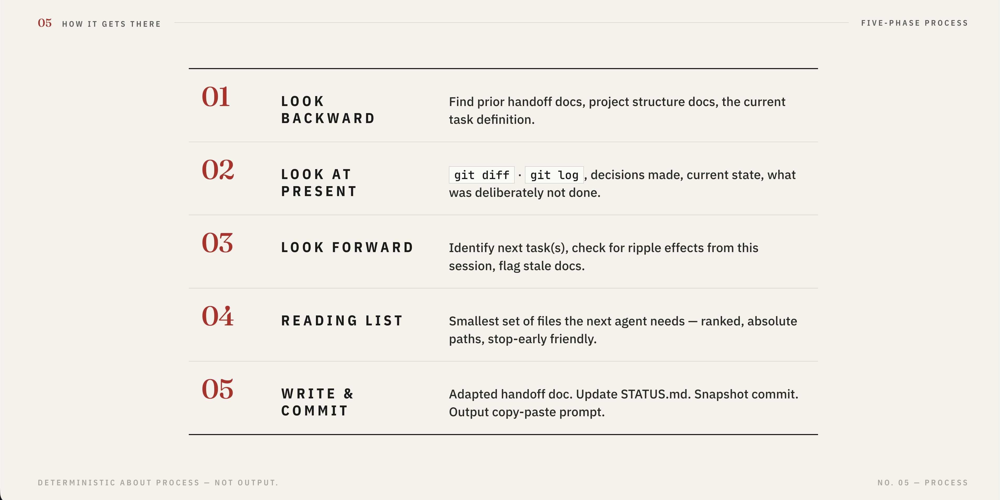

# handoff — Intelligent Context Handoff for Claude Code

> A Claude Code skill that lets you switch sessions without losing context.
> Generates a minimum-token handoff doc for the next agent and maintains a project-root `STATUS.md` log so a fresh session can orient itself in seconds.



---

## The pain

If you've vibecoded for more than a few weeks, you've hit this wall. Three quotes from the **2026-05-16 Hackathon Bottleneck Wall**, where attendees wrote their biggest AI-coding pain on sticky notes:



This skill is the answer. It treats session boundaries as a first-class engineering problem — not a hope-it-works moment.

---

## What you get

When a session wraps up, the skill produces four artifacts:

1. **A handoff document** — minimum-token context transfer for the next agent.
2. **A `STATUS.md` log entry** — appended to the project root, never overwritten.
3. **A snapshot commit** — repo state matches the handoff exactly (clean starting point + restore point).
4. **A copy-paste prompt** — drop into the next conversation, that's it.

It's not a template. The skill investigates what actually happened, figures out the minimum reading list, and writes a doc adapted to the specific situation.

---

## The killer feature: `STATUS.md`



Every handoff appends one entry to a `STATUS.md` at the project root — append-only, never overwritten, so the file becomes a scrollable history of the project. The trick: the next time you open a chat and ask **"where are we?"** or **"what's the status of this project?"**, the skill auto-reads the last entry plus `git log --oneline -5` and orients itself in seconds. No handoff prompt required. Finding `STATUS.md` becomes the default first move.

---

## Install

Clone into your Claude Code skills directory:

```bash
git clone https://github.com/phat-po/claude-skill-handoff ~/.claude/skills/handoff
```

That's it. To verify, in any Claude Code session type `/handoff` or just say "wrap up for next agent" — it should trigger.

---

## Usage

The skill triggers on any of these:

- The slash command `/handoff`
- Phrases like `handoff`, `hand off`, `pass to next agent`, `context handoff`, `next agent`, `session done`, `stage done`, `wrap up for next agent`
- Fresh-session questions like `"where are we?"` / `"what's next?"` automatically read `STATUS.md`

A typical handoff plays out like a four-line transcript:



---

## How it gets there (5-phase investigation)



The skill is deterministic about *process*, not *output* — every handoff runs through the same five investigation phases above. For the complete spec, see [`SKILL.md`](./SKILL.md).

---

## Example

See [`examples/handoff-example.md`](./examples/handoff-example.md) for a real (sanitized) handoff document, and [`examples/STATUS-example.md`](./examples/STATUS-example.md) for a sample `STATUS.md` log.

---

## Anti-patterns it avoids

- Conversation transcripts (the next agent doesn't need to know what you discussed)
- Padding with boilerplate sections (empty "Constraints", "Database", etc.)
- Over-including the reading list (every extra file costs tokens)
- Assuming the next agent reads prior handoffs (each handoff is self-contained)

---

## Compatibility

- **Claude Code** — primary target
- **Codex CLI** — works (it reads skills from the same `~/.claude/skills/` path if symlinked, or you can adapt the SKILL.md frontmatter)
- **Other Claude-compatible agents** — the SKILL.md uses standard skill frontmatter; should work anywhere the skill format is supported

---

## Background

Built and battle-tested across many vibecoding projects by [Pohan](https://github.com/phat-po). Open-sourced after the 2026-05-16 Hackathon Bottleneck Wall, where multiple attendees wrote down the same pain on sticky notes — the three quotes above.

---

## License

MIT — see [LICENSE](./LICENSE).
